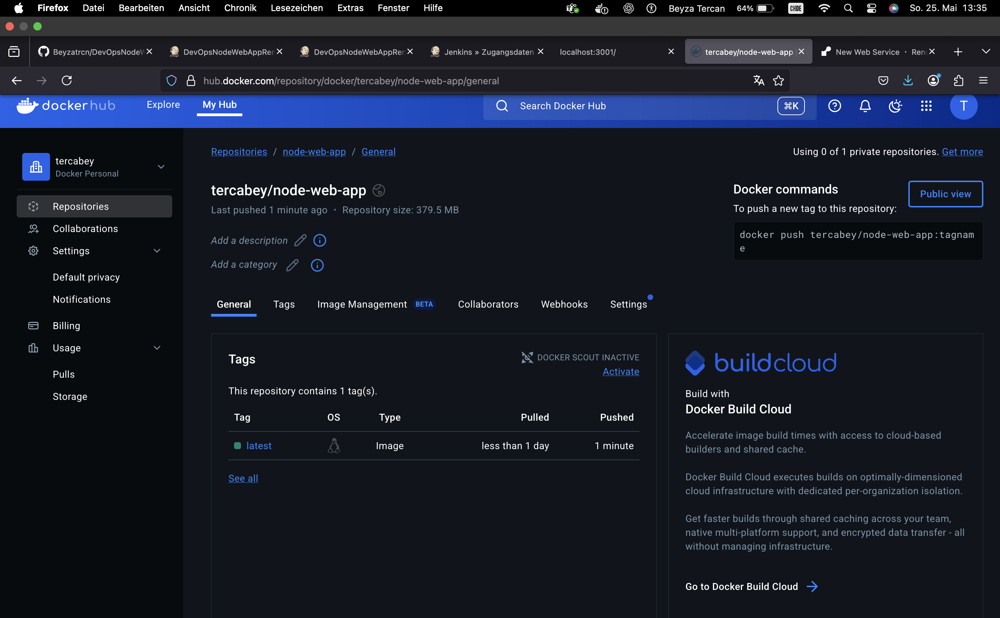

# DevOps 09 Deployment Docker
| | |
| -------- | ------- |
| Mein Repository | [Mein GitHub-Repo](https://github.com/tercabey/DevOps-09-Deployment-Docker) |
| Zusammenarbeit mit | Gedik, Hande |
| Repo URL ÜbungspartnerIn | [Repository auf GitHub](https://github.com/gedikhan/DevOps-09-Deployment-Docker) |

## Lernjournal

### 1. Vorbereitung des Repositories
- Repository [DevOpsNodeWebApp](https://github.com/Beyzatrcn/DevOpsNodeWebApp.git) auf GitHub forked und mit VS-Code verknüpft.

### 2. Jenkins-Konfiguration (lokal)
- Jenkins lokal über Docker gestartet.
- Docker-Socket verbunden (`tcp://host.docker.internal:2375`).

### 3. Jenkins-Build-Job erstellt: `DevOpsNodeWebAppDockerBuild`
- Aufgabe: Docker-Image lokal bauen mit dem Tag `beyzatrcn/node-web-app`.
- Build-Kontext: `$WORKSPACE`.
- Docker-Plugin verwendet.

### 4. Jenkins-Deploy-Job erstellt: `DevOpsNodeWebAppDockerDeploy`
- Aufgabe: Container aus gebautem Image starten.
- Port 3000:3000 gesetzt.
- Trigger: Startet nach erfolgreichem Build-Job.

### 5. Jenkins-Render-Job erstellt: `DevOpsNodeWebAppRenderDeploy`
- Aufgabe: Deployment bei Render.com triggern.
- Schritte:
  - Checkout
  - Docker Push nach DockerHub
  - API-Call an Render Deployment Endpoint.
- Trigger: Startet nach erfolgreichem Deploy-Job.

### 6. Jenkins RenderDeploy erfolgreich

### 7. Jenkins-Triggerkette

- Build-Triggers korrekt konfiguriert:

  

### 8. Jenkins prüft regelmässig Änderungen

### 9. DockerHub Repository
- Name: `tercabey/node-web-app`.
- Image wird mit `--platform linux/amd64` gepusht (kompatibel mit Render).

### 10. Render.com Konfiguration
- Neues Web Service erstellt mit bestehendem Docker-Image (`tercabey/node-web-app:latest`).
- Zugang mit DockerHub-Credentials.
- Deployment wird ausgelöst durch Render-Pipeline von Jenkins.

### 11. End-to-End-Test

- Änderung in `server.js` vorgenommen (z. B. "Test: Build Trigger").
- Commit und Push nach GitHub mit VS Code durchgeführt:
- Jenkins erkennt die Änderung, Build wird automatisch angestossen:
- Container wird aktualisiert und läuft lokal auf Port 3000:

  
  
  

- Änderung auf WebApp sichtbar:

  

### 12. Docker Image auf DockerHub veröffentlicht

### 13. Automatisiertes Deployment bei Render und auf Cloud

- Die App wird nach dem Push bei DockerHub automatisch bei Render.com deployed.
- Die Render-Instanz ist live:

  

- Die App auf Cloud ist live:

  

